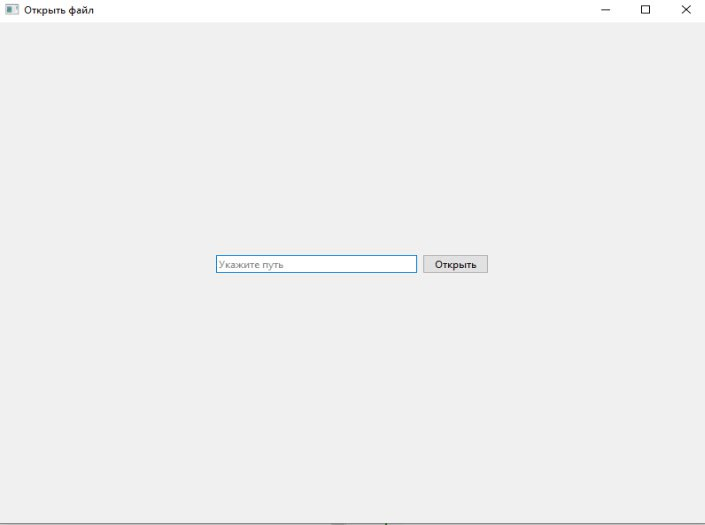

# Bank Transaction Analyzer

## Описание проекта

Данное приложение предназначено для загрузки, расшифровки и отображения банковских транзакций из зашифрованных файлов. 
Приложение обеспечивает безопасный доступ через пин-код и поддерживает работу с файлами в текстовом формате.

## Функциональные требования

### Аутентификация
- При запуске отображается диалог ввода пин-кода
- Пин-код хранится в виде хеша в коде приложения
- При неверном пин-коде приложение показывает предупреждение и завершает работу

### Интерфейс
- **Страница "Данные"** - основная страница приложения
- Отображение списка транзакций с использованием графического компонента **QTableWidget**
- Для каждой транзакции отображаются все поля

### Работа с файлами
- Кнопка "Открыть" для выбора зашифрованного файла
- Диалог выбора файла для считывания данных
- Автоматическое считывание данных при старте приложения

### Шифрование
- Файлы транзакций зашифрованы алгоритмом **AES-256-cbc**
- Автоматическая расшифровка при загрузке файла
- Возможность предварительного шифрования файлов сторонними программами

## Структура данных

### Поля банковской транзакции:
- **Хеш SHA-256-cbc** в кодировке Hex (64 символа)
- **Номер счёта списания** (16 цифр)
- **Номер счёта поступления** (16 цифр)
- **Дата и время** в формате ISO 8601

## Скриншоты интерфейса

### Окно ввода пин-кода

### Основной интерфейс

### Окно открытия файла

